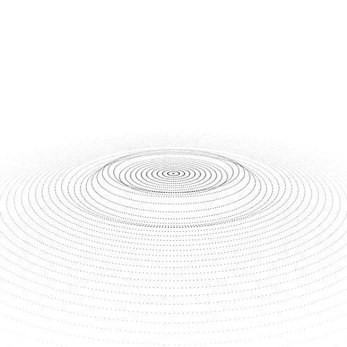

    

    Hi there 👋

    I am interested Mathematics, Physics, Biology and many other things. Please visit my <a href="https://bkb3.github.io/homepage/about">homepage</a>, to know more!

    I make scientific softwares, websites and mobile apps. Some of my work are:

    <a href="https://tisigner.otago.ac.nz">TISIGNER - Gene optimisation tools</a>,
    <a href="https://play.google.com/store/apps/details?id=io.github.bkb3.hercules">Hercules (Android app for gene optimisation)</a>

    I know these languages and frameworks:

    
    
    
    
    
    
    
    

    Contact:

    
    &nbsp;
    

